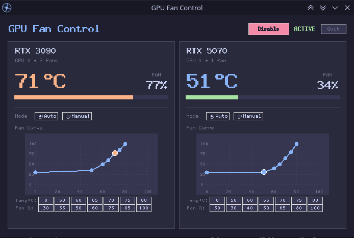

# GPU Fan Control

The NVIDIA driver's fan control logic wasn't doing it for me — too conservative, too opaque — so I built my own. This is a Linux GUI application for independent NVIDIA GPU fan control without requiring Coolbits. Uses pynvml via a root helper subprocess for direct fan management.



## Features

- Dark theme GUI (Catppuccin Mocha)
- Multiple GPU support with independent fan curves
- Auto mode (temperature-based interpolation) and manual mode (fixed speed)
- Passwordless sudo integration
- Persistent configuration in `~/.config/gpu-fancontrol/config.json`
- Minimizes to taskbar on startup

## Requirements

- Linux with NVIDIA GPU and drivers
- Python 3.7+
- `libnvidia-ml.so.1` (usually bundled with NVIDIA drivers)

## Installation

1. **Install dependencies:**
   ```bash
   pip install -r requirements.txt
   ```

2. **Set up passwordless sudo** for the fan helper:
   ```bash
   sudo bash setup_sudoers.sh
   ```
   > Edit `setup_sudoers.sh` first to match your Python path if not using the default.

3. **Run:**
   ```bash
   python3 gpu_fancontrol.py
   ```

## Architecture

- `gpu_fancontrol.py` — Main GUI application (tkinter)
- `fan_helper.py` — Root helper subprocess; communicates via JSON over stdin/stdout
- `setup_sudoers.sh` — One-time sudoers configuration

### Helper Protocol

```json
{"cmd": "set",       "gpu": 0, "fan": 0, "speed": 75}
{"cmd": "reset",     "gpu": 0, "fan": 0}
{"cmd": "reset_all"}
{"cmd": "quit"}
```

## Configuration

Config is auto-saved to `~/.config/gpu-fancontrol/config.json` and includes per-GPU fan curves and mode settings.

## Notes

- `setup_sudoers.sh` contains a hardcoded Python path (`/home/ika/miniconda3/bin/python3`) — update it to match your system before running.
- Fan control requires the NVIDIA driver to support manual fan speed override on your GPU model.
